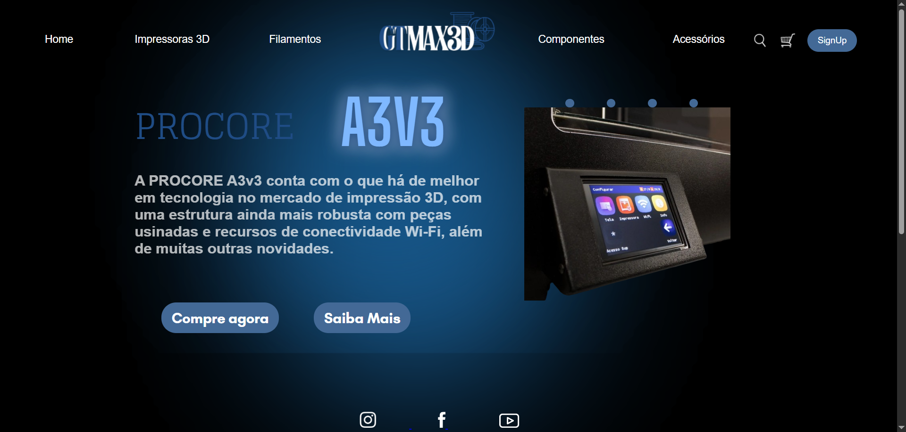
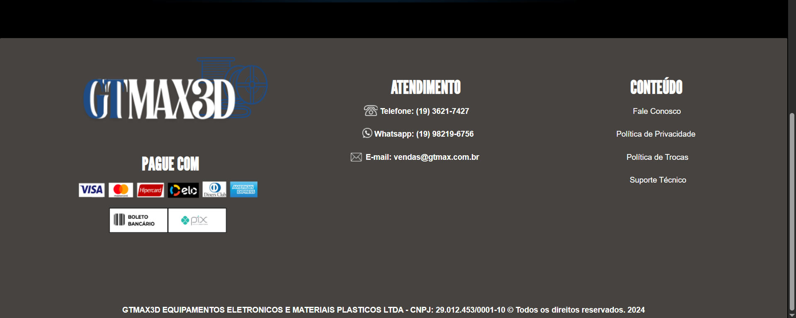

<h1 aling="center"> Projeto Inovar - GTMax3d . ݁₊ ⊹ . ݁˖ . ݁ </h1>

<i> O projeto foi desenvolvido no primeiro semestre de 2024 com o objetivo de criar a nova identidade de uma marca já existente, meu grupo escolheu a GTMax3D, uma empresa nacional que fabrica e revende impressoras 3D e filamentos para impressão. O site foi realizado utilizando HTML e CSS com o foco em uma das impressoras mais famosas da marca, a Impressora3D pro - core A3V3, com o fim de proporcionar uma melhor experiência para o usuário. 

## Créditos ๋࣭⭑

[GTMax3D](https://www.gtmax3d.com.br/)

## Desenvolvimento ๋࣭⭑

## Participações ๋࣭⭑

[Isabelly Dias](https://github.com/IDBaptista)  
[Maria Eduarda Gomes](https://github.com/MariaGomesR)  
[Mirele Victória](https://github.com/Mvictoria218)

## ─── ⋆⋅Links⋅⋆ ──

[Site](https://projeto-inovar-gtmax-2024.onrender.com/)  
[Protótipo](https://www.canva.com/design/DAGPQWK2Zbk/-F_48erDzhS2CUg6fJqSag/edit)

<i> . ܁ . ܁₊ ⊹ . ܁ ⟡ ܁ . ⊹ ₊ ܁. . ܁₊ ⊹ . ܁ ⟡ ܁ . ⊹ ₊ ܁. . ܁₊ ⊹ . ܁ ⟡ ܁ . ⊹ ₊ ܁.. ܁₊ ⊹ . ܁ ⟡ ܁ . ⊹ ₊ . ܁₊ ⊹ . ܁ ⟡ ܁ . ⊹ ₊ ܁.. ܁₊ ⊹ . ܁ ⟡ ܁ . ⊹ ₊ ܁.. ܁₊ ⊹ . ܁ ⟡ ܁ . ⊹ ₊ 
